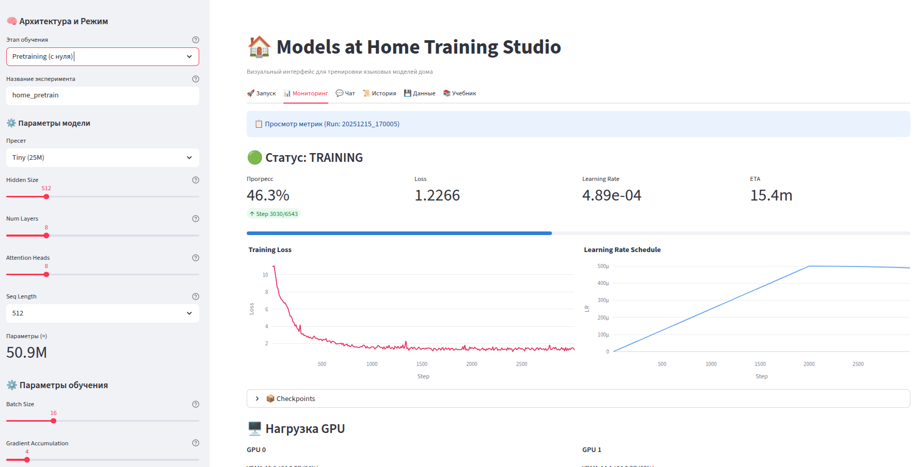

# 🏠 Models at Home

<p align="center">
  <a href="README.md">English</a> |
  <a href="README_RU.md">Русский</a>
</p>

[](https://opensource.org/licenses/Apache-2.0)
[](https://www.python.org/downloads/)
[](https://www.docker.com/)

**Models at Home** is an open-source studio for training and fine-tuning Large Language Models (LLMs) at home. The project aims to make Deep Learning technologies accessible to everyone.



## ✨ Features

### 🎯 Training Modes
- **Pretraining** — Train a model from scratch on raw text data
- **Continual Pretraining** — Continue training an existing model on new data
- **SFT (Supervised Fine-Tuning)** — Train model to follow instructions and chat
- **GRPO (Group Relative Policy Optimization)** — Reinforcement Learning for reasoning tasks
- **VLM SFT** — Fine-tune Vision-Language Models (e.g. LLaVA) on image + text data (see **VLM Studio** page)

### 🖥️ Visual Interface
- **Browser-based GUI** — Configure, launch, and monitor training without writing code
- **VLM Studio** — Dedicated page for Vision-Language Models: SFT tuning, chat with images, data preview
- **Real-time Monitoring** — Live graphs for loss, learning rate, GPU utilization
- **Run History** — Track all experiments with logs and checkpoints
- **Built-in Documentation** — Tutorials and references right in the app

### 💬 Chat & Inference
- **Chat with Models** — Test trained models directly in the app
- **vLLM Support** — Fast inference with vLLM backend
- **Chat Templates** — Automatic detection and formatting for conversations

### 📦 Model Management
- **Download from HuggingFace** — One-click download of popular models (SmolLM2, Pythia, Qwen, TinyLlama)
- **Use as Base** — Downloaded models can be used for Continual Pretraining or SFT

### 💾 Data Management
- **HuggingFace Datasets** — Stream datasets directly from HuggingFace Hub
- **Filters & Limits** — Configure size limits, quality filters, language filters
- **Auto-detection** — Automatic format detection (Chat/Instruct)

### ⚡ Distributed Training
- **Multi-GPU** — Scale across multiple GPUs
- **FSDP** — PyTorch Fully Sharded Data Parallel
- **DeepSpeed ZeRO** — ZeRO-2, ZeRO-3, CPU Offload

### 🏗️ Model Architecture
- Modern Transformer (Llama-style) with RoPE, SwiGLU, RMSNorm
- Flash Attention for efficient training
- KV-Cache for fast generation

### 🌐 Multilingual Interface
- **English** and **Russian** UI
- Easy to add new languages

---

## 🚀 Quick Start (Docker) — Recommended

The easiest way to run the studio without dealing with CUDA and PyTorch installation.

### Requirements
- **Docker Desktop** (Windows/Mac) or **Docker Engine** (Linux)

### Launch

1. **Clone the repository:**
   ```bash
   git clone https://github.com/researchim-ai/models-at-home.git
   cd models-at-home
   ```

2. **Run with Docker Compose:**
   ```bash
   export UID=$(id -u)
   export GID=$(id -g)
   docker compose up --build
   ```

3. **Open in browser:**
   Navigate to: [http://localhost:8501](http://localhost:8501)

All data (datasets, model weights, logs) is saved to `datasets/`, `out/`, and `.runs/` folders on your machine.

If files were created earlier by root inside Docker, fix ownership once:
```bash
sudo chown -R "$(id -u):$(id -g)" datasets out .runs models .cache
```

---

## 🛠️ Running Without Docker (Local)

If you prefer running code directly on your system.

### Requirements
- Python 3.10+
- CUDA Toolkit 11.8+ (for GPU)

### Installation

1. **Create virtual environment:**
   ```bash
   python -m venv venv
   
   # Linux/Mac
   source venv/bin/activate
   
   # Windows
   venv\Scripts\activate
   ```

2. **Install PyTorch (with CUDA support):**
   Visit [pytorch.org](https://pytorch.org/get-started/locally/) for the command for your system. For example:
   ```bash
   pip install torch torchvision torchaudio --index-url https://download.pytorch.org/whl/cu121
   ```

3. **Install dependencies:**
   ```bash
   pip install -r requirements.txt
   ```

4. **Install package in development mode:**
   ```bash
   pip install -e .
   ```

5. **Configure Accelerate (once):**
   ```bash
   accelerate config
   ```

### Launch Studio

Run the script:
```bash
./scripts/run_studio.sh
# Or on Windows:
streamlit run homellm/app/LLM.py
```

---

## 📚 Project Structure

```
models-at-home/
├── homellm/                    # Main package
│   ├── models/                 # Model architectures
│   │   ├── home_model.py       # HomeConfig, HomeForCausalLM
│   │   ├── home_model_moe.py   # Mixture of Experts variant
│   │   └── blueprint.py        # Visual model builder
│   ├── training/               # Training scripts
│   │   ├── pretrain.py         # Pretraining
│   │   ├── sft.py              # Supervised Fine-Tuning
│   │   ├── vlm_sft.py          # VLM SFT (e.g. LLaVA)
│   │   └── rl/                 # Reinforcement Learning (GRPO)
│   ├── app/                    # Streamlit GUI
│   │   ├── LLM.py              # Main application
│   │   ├── pages/
│   │   │   └── 05_VLM_Studio.py # VLM Studio page
│   │   └── docs.py             # Built-in documentation
│   ├── cli/                    # Command-line interface
│   │   └── chat.py             # Interactive chat
│   └── i18n/                   # Internationalization
│       └── locales/            # en.json, ru.json
├── configs/                    # Accelerate/DeepSpeed configs
├── datasets/                   # Downloaded datasets
├── models/                     # Downloaded models
└── out/                        # Trained models and checkpoints
```

---

## 📊 Training Workflow

### 1. Pretraining (From Scratch)

Train a new model on raw text data:

1. Go to **💾 Data** tab
2. Select a text corpus (e.g., FineWeb-2)
3. Configure size limits and download
4. Go to **🚀 Launch** tab
5. Select **Pretraining** mode
6. Choose model size preset (Tiny, Small, Base, etc.)
7. Click **▶️ Start Training**

### 2. SFT (Supervised Fine-Tuning)

Turn your pretrained model into a chatbot:

1. Download an instruction dataset (e.g., OpenOrca)
2. Go to **🚀 Launch** → **SFT** mode
3. Select your pretrained model as base
4. Configure chat template and field mappings
5. Start training

### 3. GRPO (Reinforcement Learning)

Improve reasoning with reward-based training:

1. Go to **🚀 Launch** → **GRPO** mode
2. Select SFT model as base
3. Design reward functions (format, math correctness)
4. Configure rollout parameters
5. Start RL training

### 4. Chat with Model

Test your trained model:

1. Go to **💬 Chat** tab
2. Select model or checkpoint
3. Configure generation parameters
4. Start chatting!

### 5. VLM Studio (Vision-Language Models)

Tune and chat with VLMs (e.g. LLaVA, Qwen2-VL):

1. Open **VLM Studio** from the sidebar (or navigate to the VLM Studio page)
2. **Launch**: Choose base VLM (HF ID or local path), dataset (JSONL with `image` + `conversations` or `caption`), tuning (LoRA/QLoRA/full), and hyperparameters → Start VLM SFT
3. **Monitoring**: View loss, steps, and logs for VLM runs
4. **Chat**: Upload an image and prompt; select a VLM to get a response
5. **Data**: Preview JSONL rows (image thumbnail + text). Format: `{"image": "path_or_url", "conversations": [{"role": "user", "content": "..."}, {"role": "assistant", "content": "..."}]}` or `{"image": "...", "caption": "..."}`

---

## ⚡ Distributed Training

| Mode | Config | Description | When to Use |
|------|--------|-------------|-------------|
| **Multi-GPU (DDP)** | `accelerate_multi_gpu.yaml` | Model replication | Model fits in 1 GPU |
| **FSDP** | `accelerate_fsdp.yaml` | PyTorch Fully Sharded | >1B params, multiple GPUs |
| **DeepSpeed ZeRO-2** | `accelerate_deepspeed_zero2.yaml` | Optimizer/gradient sharding | 100M-1B params |
| **DeepSpeed ZeRO-3** | `accelerate_deepspeed_zero3.yaml` | Full sharding | >1B params |
| **ZeRO-3 + Offload** | `accelerate_deepspeed_zero3_offload.yaml` | Sharding + CPU offload | Very large models |

---

## 📈 Model Sizes

| Configuration | Parameters | VRAM (fp16) | Recommendation |
|---------------|------------|-------------|----------------|
| Tiny (512-8-8) | ~25M | ~2 GB | GTX 1060+ |
| Small (768-12-12) | ~80M | ~4 GB | RTX 2060+ |
| Base (1024-16-16) | ~200M | ~8 GB | RTX 3080+ |
| Medium (1536-24-16) | ~400M | ~12 GB | RTX 3090+ |
| Large (2048-24-16) | ~700M | ~16 GB | RTX 4090+ |

---

## 🔗 HuggingFace Integration

Models are fully compatible with the HuggingFace ecosystem:

```python
from homellm.models import HomeConfig, HomeForCausalLM
from transformers import AutoTokenizer

# Load
tokenizer = AutoTokenizer.from_pretrained("gpt2")
model = HomeForCausalLM.from_pretrained("out/home_pretrain/final_model")

# Generate
inputs = tokenizer("Hello", return_tensors="pt")
outputs = model.generate(**inputs, max_new_tokens=50)
print(tokenizer.decode(outputs[0]))
```

---

## 🤝 Contributing

We welcome Pull Requests! If you have ideas for improving the interface, optimizing training, or supporting new architectures — please contribute.

## 📄 License

Apache 2.0
