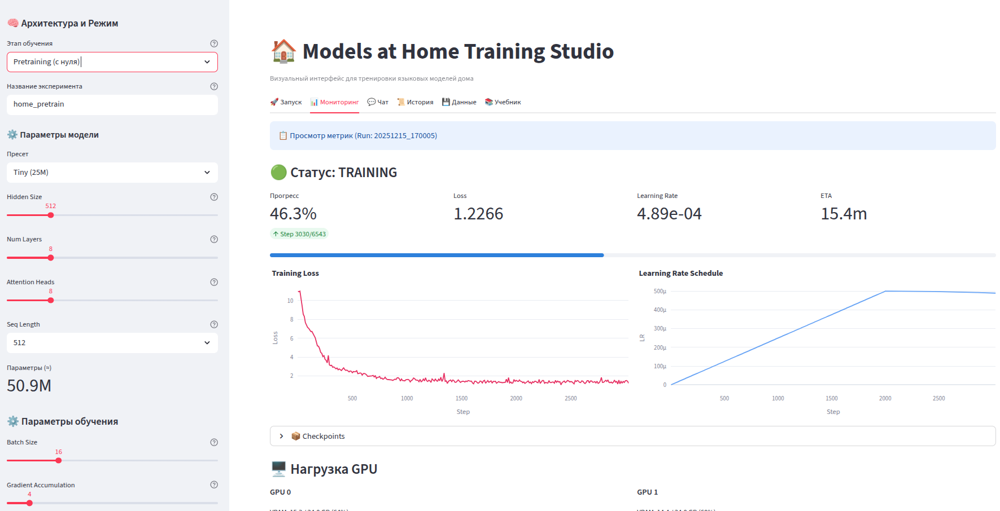

# 🏠 Models at Home

<p align="center">
  <a href="README.md">English</a> |
  <a href="README_RU.md">Русский</a>
</p>

[](https://opensource.org/licenses/Apache-2.0)
[](https://www.python.org/downloads/)
[](https://www.docker.com/)

**Models at Home** — это open-source студия для тренировки и дообучения больших языковых моделей (LLM) в домашних условиях. Проект создан, чтобы сделать технологии Deep Learning доступными для каждого.



## ✨ Возможности

### 🎯 Режимы обучения
- **Pretraining** — Обучение модели с нуля на сырых текстовых данных
- **Continual Pretraining** — Продолжение обучения существующей модели на новых данных
- **SFT (Supervised Fine-Tuning)** — Дообучение модели следовать инструкциям и вести диалог
- **GRPO (Group Relative Policy Optimization)** — Reinforcement Learning для задач рассуждения

### 🖥️ Визуальный интерфейс
- **GUI в браузере** — Настройка, запуск и мониторинг обучения без написания кода
- **Мониторинг в реальном времени** — Графики loss, learning rate, загрузки GPU
- **История запусков** — Отслеживание всех экспериментов с логами и чекпоинтами
- **Встроенная документация** — Туториалы и справочники прямо в приложении

### 💬 Чат и инференс
- **Чат с моделями** — Тестируйте обученные модели прямо в приложении
- **Поддержка vLLM** — Быстрый инференс с бэкендом vLLM
- **Chat Templates** — Автоматическое определение и форматирование диалогов

### 📦 Управление моделями
- **Загрузка с HuggingFace** — Скачивание популярных моделей в один клик (SmolLM2, Pythia, Qwen, TinyLlama)
- **Использование как базу** — Скачанные модели можно использовать для Continual Pretraining или SFT

### 💾 Управление данными
- **HuggingFace Datasets** — Стриминг датасетов напрямую из HuggingFace Hub
- **Фильтры и лимиты** — Настройка ограничений по размеру, фильтры качества и языка
- **Автодетект** — Автоматическое определение формата (Chat/Instruct)

### ⚡ Распределённое обучение
- **Multi-GPU** — Масштабирование на несколько GPU
- **FSDP** — PyTorch Fully Sharded Data Parallel
- **DeepSpeed ZeRO** — ZeRO-2, ZeRO-3, CPU Offload

### 🏗️ Архитектура модели
- Современный трансформер (Llama-style) с RoPE, SwiGLU, RMSNorm
- Flash Attention для эффективного обучения
- KV-Cache для быстрой генерации

### 🌐 Мультиязычный интерфейс
- **Английский** и **Русский** интерфейс
- Легко добавить новые языки

---

## 🚀 Быстрый старт (Docker) — Рекомендуется

Самый простой способ запустить студию, не мучаясь с установкой CUDA и PyTorch.

### Требования
- **Docker Desktop** (Windows/Mac) или **Docker Engine** (Linux)

### Запуск

1. **Клонируйте репозиторий:**
   ```bash
   git clone https://github.com/researchim-ai/models-at-home.git
   cd models-at-home
   ```

2. **Запустите через Docker Compose:**
   ```bash
   docker-compose up --build
   ```

3. **Откройте в браузере:**
   Перейдите по адресу: [http://localhost:8501](http://localhost:8501)

Все данные (датасеты, веса моделей, логи) сохраняются в папках `datasets/`, `out/` и `.runs/` на вашем компьютере.

---

## 🛠️ Запуск без Docker (Локально)

Если вы хотите запускать код напрямую в своей системе.

### Требования
- Python 3.10+
- CUDA Toolkit 11.8+ (для GPU)

### Установка

1. **Создайте виртуальное окружение:**
   ```bash
   python -m venv venv
   
   # Linux/Mac
   source venv/bin/activate
   
   # Windows
   venv\Scripts\activate
   ```

2. **Установите PyTorch (с поддержкой CUDA):**
   Посетите [pytorch.org](https://pytorch.org/get-started/locally/) для получения команды под вашу систему. Например:
   ```bash
   pip install torch torchvision torchaudio --index-url https://download.pytorch.org/whl/cu121
   ```

3. **Установите остальные зависимости:**
   ```bash
   pip install -r requirements.txt
   ```

4. **Установите пакет в режиме разработки:**
   ```bash
   pip install -e .
   ```

5. **Настройте Accelerate (один раз):**
   ```bash
   accelerate config
   ```

### Запуск Студии

Запустите скрипт:
```bash
./scripts/run_studio.sh
# Или на Windows:
streamlit run homellm/app/LLM.py
```

---

## 📚 Структура проекта

```
models-at-home/
├── homellm/                    # Основной пакет
│   ├── models/                 # Архитектуры моделей
│   │   ├── home_model.py       # HomeConfig, HomeForCausalLM
│   │   ├── home_model_moe.py   # Mixture of Experts вариант
│   │   └── blueprint.py        # Визуальный конструктор модели
│   ├── training/               # Скрипты обучения
│   │   ├── pretrain.py         # Претрейн
│   │   ├── sft.py              # Supervised Fine-Tuning
│   │   └── rl/                 # Reinforcement Learning (GRPO)
│   ├── app/                    # Streamlit GUI
│   │   ├── LLM.py              # Главное приложение
│   │   └── docs.py             # Встроенная документация
│   ├── cli/                    # Командная строка
│   │   └── chat.py             # Интерактивный чат
│   └── i18n/                   # Интернационализация
│       └── locales/            # en.json, ru.json
├── configs/                    # Конфиги Accelerate/DeepSpeed
├── datasets/                   # Скачанные датасеты
├── models/                     # Скачанные модели
└── out/                        # Обученные модели и чекпоинты
```

---

## 📊 Процесс обучения

### 1. Pretraining (Обучение с нуля)

Обучение новой модели на сырых текстовых данных:

1. Перейдите на вкладку **💾 Данные**
2. Выберите текстовый корпус (например, FineWeb-2)
3. Настройте лимиты и скачайте
4. Перейдите на вкладку **🚀 Запуск**
5. Выберите режим **Pretraining**
6. Выберите пресет размера модели (Tiny, Small, Base и т.д.)
7. Нажмите **▶️ Начать тренировку**

### 2. SFT (Supervised Fine-Tuning)

Превратите претрейн-модель в чат-бота:

1. Скачайте датасет с инструкциями (например, OpenOrca)
2. Перейдите в **🚀 Запуск** → режим **SFT**
3. Выберите вашу претрейн-модель как базовую
4. Настройте chat template и маппинг полей
5. Запустите обучение

### 3. GRPO (Reinforcement Learning)

Улучшите рассуждения с помощью reward-based обучения:

1. Перейдите в **🚀 Запуск** → режим **GRPO**
2. Выберите SFT-модель как базовую
3. Настройте функции наград (формат, корректность математики)
4. Настройте параметры rollout
5. Запустите RL-обучение

### 4. Чат с моделью

Протестируйте обученную модель:

1. Перейдите на вкладку **💬 Чат**
2. Выберите модель или чекпоинт
3. Настройте параметры генерации
4. Начните общение!

---

## ⚡ Распределённое обучение

| Режим | Конфиг | Описание | Когда использовать |
|-------|--------|----------|-------------------|
| **Multi-GPU (DDP)** | `accelerate_multi_gpu.yaml` | Репликация модели | Модель помещается в 1 GPU |
| **FSDP** | `accelerate_fsdp.yaml` | PyTorch Fully Sharded | >1B параметров, несколько GPU |
| **DeepSpeed ZeRO-2** | `accelerate_deepspeed_zero2.yaml` | Шардирование оптимизатора | 100M-1B параметров |
| **DeepSpeed ZeRO-3** | `accelerate_deepspeed_zero3.yaml` | Полное шардирование | >1B параметров |
| **ZeRO-3 + Offload** | `accelerate_deepspeed_zero3_offload.yaml` | Шардирование + CPU offload | Очень большие модели |

---

## 📈 Размеры моделей

| Конфигурация | Параметры | VRAM (fp16) | Рекомендация |
|--------------|-----------|-------------|--------------|
| Tiny (512-8-8) | ~25M | ~2 GB | GTX 1060+ |
| Small (768-12-12) | ~80M | ~4 GB | RTX 2060+ |
| Base (1024-16-16) | ~200M | ~8 GB | RTX 3080+ |
| Medium (1536-24-16) | ~400M | ~12 GB | RTX 3090+ |
| Large (2048-24-16) | ~700M | ~16 GB | RTX 4090+ |

---

## 🔗 Интеграция с HuggingFace

Модели полностью совместимы с экосистемой HuggingFace:

```python
from homellm.models import HomeConfig, HomeForCausalLM
from transformers import AutoTokenizer

# Загрузка
tokenizer = AutoTokenizer.from_pretrained("gpt2")
model = HomeForCausalLM.from_pretrained("out/home_pretrain/final_model")

# Генерация
inputs = tokenizer("Привет", return_tensors="pt")
outputs = model.generate(**inputs, max_new_tokens=50)
print(tokenizer.decode(outputs[0]))
```

---

## 🤝 Вклад в проект

Мы приветствуем Pull Requests! Если у вас есть идеи по улучшению интерфейса, оптимизации обучения или поддержке новых архитектур — пишите.

## 📄 Лицензия

Apache 2.0
